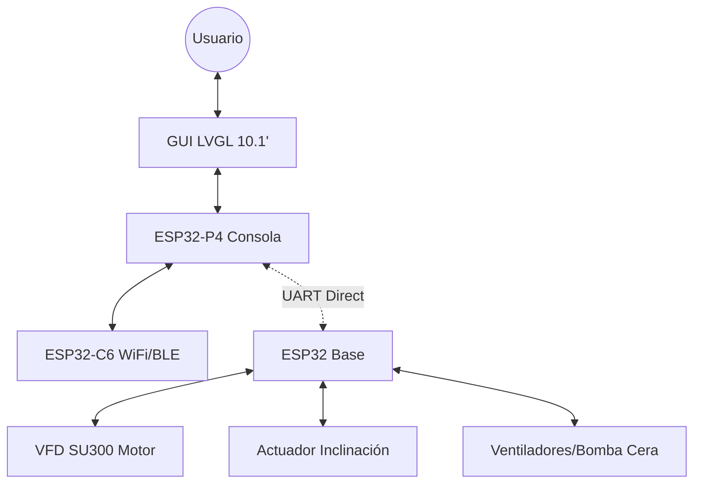

# Documento Maestro: Estado Actual del Proyecto Treadmill (Diciembre 2025)

Este documento proporciona una "fotografía detallada" y completa del sistema de control de la cinta de correr. Describe la arquitectura, el hardware, la lógica de software y los protocolos operativos tal como están implementados en el código actual.

---

## 1. Visión Holística del Sistema

El proyecto Treadmill es un sistema de control distribuido de alta fidelidad compuesto por dos nodos principales que se comunican mediante una **conexión directa UART de 3 hilos (TX, RX y GND común)**.

### Nodos del Sistema:
1.  **Consola (Maestro)**: Basada en el SoC de alto rendimiento **ESP32-P4**. Actúa como el centro de mando (HMI), gestionando la interfaz gráfica de 10.1", la conectividad inalámbrica y la lógica de entrenamiento.
2.  **Base (Esclavo)**: Basada en un **ESP32** convencional. Es el controlador de potencia que interactúa físicamente con el motor (VFD), el actuador de inclinación, los ventiladores y los sensores de seguridad.

---

## 2. Nodo Consola (Maestro) en Detalle

### 2.1 Hardware de Visualización y Control
-   **SoC**: ESP32-P4 (Dual-core RISC-V @ 400MHz).
-   **Display**: Panel JD9365 de 10.1" (800x1280 nativo, operando a 1280x800).
    -   **Interfaz**: MIPI-DSI con 2 lanes de datos a 1.5 Gbps.
    -   **Driver**: `esp_lcd_jd9365`.
-   **Touch**: Panel capacitivo Multi-touch.
    -   **Controlador**: GSL3680 (vía I2C).
-   **Memoria Gráfica**: Doble buffer en **PSRAM** (32MB Octal-SPI). Por estabilidad en el P4, se utiliza una configuración **DMA-less** (acceso directo CPU) para evitar colisiones de bus MIPI.

### 2.2 Subsistemas de Software
-   **Interfaz de Usuario (LVGL v8.3)**: Arquitectura de múltiples pantallas controlada por `ui.c`.
-   **Arquitectura de Red (ESP-Hosted)**: El ESP32-P4 no gestiona directamente los radios WiFi/BLE. Estas tareas se delegan a un co-procesador **ESP32-C6** mediante un protocolo de túnel.
-   **Periféricos de Consola**:
    -   **Expansor de Botones**: MCP23017 (I2C) para gestionar la botonera física de 10 botones con debounce por software.
    -   **Audio**: DAC I2S con codec dedicado para generación de feedback auditivo (1kHz beep asíncrono).
-   **Estado Global (`treadmill_state.h`)**: Estructura thread-safe protegida por mutex que centraliza todas las métricas.

---

## 3. Nodo Base (Esclavo) en Detalle

### 3.1 Gestión de Potencia y Movimiento (v6 Pinout)
-   **Motor Principal (VFD SU300)**: Controlado exclusivamente por **Modbus RTU** a 9600 bps.
-   **Motor de Inclinación (Lineal)**: Control mediante dos relés (ON/OFF y Dirección Up/Down).
-   **Pinout Crítico**:
    -   UART Modbus: TX=19, RX=18 (UART2).
    -   Incline Limit: GPIO 21.

### 3.2 Seguridad y Periféricos
-   **Watchdog de Comunicación**: Timeout de 1000ms sobre el enlace UART.
-   **Bomba de Cera / Ventiladores**: Control digital directo mediante relés.

---

## 4. El Protocolo de Comunicación (SYNC v3.0)

El sistema utiliza un enlace UART directo (3 hilos: TX, RX, GND) a **115200 bps (8N1)**.

### 4.1 Ciclo de Vida de la Comunicación (Round-Trip)
La comunicación sigue un modelo de **Maestro (Consola) - Esclavo (Base)** síncrono por ráfagas:
1.  **Maestro**: Envía una trama `SYNC` cada **100 ms**.
2.  **Esclavo**: Recibe la trama, la parsea, actualiza objetivos y genera **inmediatamente** una respuesta `DATA`.

### 4.2 Especificación de Tramas

#### A. Maestro → Esclavo: La Trama `SYNC`
Formato: `SYNC=speed,incline,fan_head,fan_chest,wax,training_mode\n`

#### B. Esclavo → Maestro: La Trama `DATA`
Formato: `DATA=v,i,f,vf,fh,fc,if\n`

---

## 5. Fotografía de Estado del Hardware y Limitaciones

### 5.1 Estado de los Sensores
-   **Sensor Hall (Velocidad)**: 🚩 **DESHABILITADO** por ruido excesivo. Velocidad estimada vía frecuencia del VFD.
-   **Fin de Carrera (Inclinación)**: Conectado al GPIO 21 con pull-up interno.

---

## 6. La Interfaz de Usuario (HMI)

El sistema utiliza **LVGL v8.3** como motor gráfico, diseñado para entornos de alto rendimiento.

### 6.1 Arquitectura y Jerarquía de Pantallas
1.  **Selector de Entrenamiento (`scr_training_select`)**: Pantalla inicial con modos principales y configuración.
2.  **Dashboard Principal (`scr_main`)**: Muestra métricas críticas (Velocidad, Inclinación, BPM, Kcal, Tiempo, Distancia).
3.  **Modo de Ajuste (`scr_set`)**: Interfaz de teclado numérico (Numpad) para entrada directa.
4.  **Conectividad**: Gestores de WiFi y BLE con teclados y listas dinámicas.

### 6.2 Sincronización de Datos (Data Binding)
La interfaz se sincroniza con el núcleo mediante la tarea `ui_update_task` (**10Hz**), utilizando un esquema de "dirty checking" para actualizar labels solo si el valor real ha cambiado en el mutex de estado.

---

## 7. Subsistema de Conectividad (WiFi y BLE)

### 7.1 Gestión de Red WiFi
-   **Persistencia**: Utiliza NVS (`wifi_creds`) con lógica de prioridad por uso (`SSID_ORDER_KEY`).
-   **Monitoreo**: Tarea en segundo plano verifica conectividad a internet.
-   **Sincronización**: Envío de entrenamientos vía HTTP POST (PHP backend) y descarga de planes.

### 7.2 Integración Biométrica BLE
-   **NimBLE Client**: Especializado en HRM (UUID `0x180D`).
-   **Auto-Reconexión**: Escaneo persistente del último dispositivo conocido almacenado en NVS.

---

## 8. Lógica Operativa de la Base (Control de Movimiento)

### 8.1 Control del VFD (SU300)
-   **Modbus RTU**: Registros `0x2000` (Control), `0x2001` (Frecuencia), `0x2103` (Frecuencia Real).
-   **Calibración**: Ratio de **7.8125 Hz/km/h**.

### 8.2 Algoritmo de Calibración (Homing) de Inclinación
Dado que el actuador usa estimación por tiempo, el sistema implementa una rutina de "autocorrección" física mediante un fin de carrera (limit switch) en GPIO 21.

#### Triggers de Calibración: ¿Cuándo ocurre?
-   **Arranque en Frío (Cold Boot)**: Al encenderse, el sistema busca siempre el punto 0% para inicializar la referencia.
-   **Salida de Modo Entrenamiento**: Al volver a la pantalla inicial (desactivar `training_mode`), el sistema fuerza un homing para asegurar que el actuador reposa en el punto de menor tensión mecánica.
-   **Comando Maestro**: Mediante el comando ASCII `CALIBRATE_INCLINE=`.
-   **Objetivo 0% (Modo Descenso a Cero)**: Siempre que el usuario selecciona una inclinación de 0.0%, el sistema no se detiene por cálculo; baja hasta tocar físicamente el switch para resetear el error acumulado por deriva temporal.
-   **Auto-recalibración**: Si durante cualquier descenso el switch se activa prematuramente, se recalibra la posición real a 0.0% instantáneamente.

#### Algoritmo Paso a Paso:
1.  **Carga de NVS**: Se lee la última posición guardada.
2.  **Cálculo de Timeout Dinámico**: Para evitar esperas innecesarias de 45s, el sistema calcula: `Timeout = (Posicion_Guardada / 0.375%/s) + 5s (margen)`.
3.  **Descenso Forzado**: Activa motor en dirección abajo.
4.  **Bucle de Validación**:
    -   **Éxito**: Si toca Switch, detiene motor y establece `real_incline = 0.0`.
    -   **Fallo (Timeout)**: Si excede el tiempo calculado, asume fallo de hardware.
    -   **Fallo (Umbral)**: Si la estimación baja de **-2.0%** sin tocar el switch, dispara estado de error crítico.

#### Parámetros Técnicos:
-   **Velocidad Nominal**: 0.375% por segundo (Aprox. 40s para el rango 0-15%).
-   **Umbral de Seguridad**: -2.0% (Protección contra switch desconectado o bloqueado).

#### 8.3 Resiliencia y Mantenimiento del Hardware
Ante el entorno de alta vibración y el uso de memoria Flash, el firmware de la Base aplica medidas específicas:

-   **Antirebote (Debounce) Dinámico**: El sensor de fin de carrera (GPIO 21) no activa la lógica por interrupción simple. La función `is_limit_switch_pressed` implementa una validación de **50ms de estabilidad**. Si el contacto se pierde por una vibración puntual en menos de ese tiempo, el sistema lo descarta como ruido, evitando paradas falsas durante el entrenamiento intenso.
-   **Gestión de Ciclos de Flash (NVS)**: Para proteger la vida útil del ESP32, la escritura de posición en NVS no ocurre de forma continua durante el movimiento. Solo se realiza una operación de `nvs_commit` al **detenerse el motor** (llegada a target o homing completado). Esto garantiza que, incluso en entrenamientos con cambios constantes de pendiente, la degradación de las celdas de memoria sea insignificante a lo largo de los años.

---

## 9. Seguridad Multinivel y Tolerancia a Fallos

### 9.1 Watchdogs y Parada de Emergencia
-   **UART Watchdog (1000ms)**: Parada inmediata del motor si se pierde el enlace.
-   **VFD Faults**: Monitoreo constante del registro `0x2100` para errores de variador.
-   **Safe State**: Transición inmediata a STOP y bloqueo de UI ante fallos críticos.

---

**Fin del Informe**
**Estado**: Estable / Documentado al 100%
**Autor**: Antigravity AI
